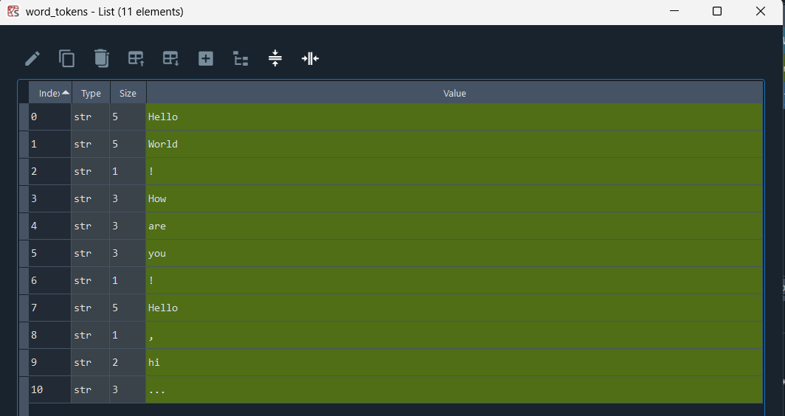
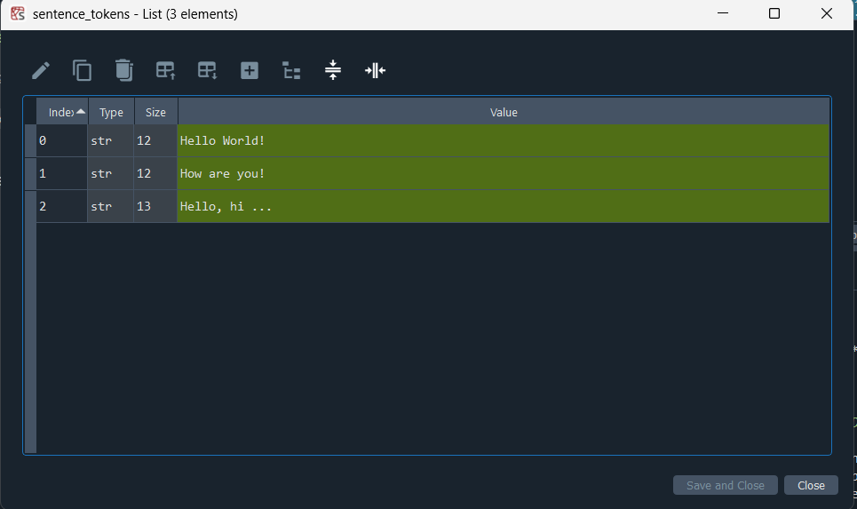

# NLP Text Tokenization ✂️

This repository demonstrates the basics of **Tokenization** in Natural Language Processing (NLP) using Python. Tokenization is the essential step of breaking down a text into smaller, meaningful units like sentences or words.

## 🚀 Features
- **Word Tokenization:** Splitting text into individual words. Punctuation marks are also treated as distinct tokens.
- **Sentence Tokenization:** Splitting a paragraph into individual sentences.

## 🛠️ Libraries Used
- `nltk` (Natural Language Toolkit)

## 💻 How to Run
1. Make sure you have the NLTK library installed in your environment (`pip install nltk`).
2. Run the `tokenization.py` script. 
*Note: The script will automatically download the required `punkt` and `punkt_tab` datasets on its first run.*

## 🖥️ Variable Outputs (Spyder IDE)
We executed the code in Spyder IDE and inspected the arrays using the Variable Explorer. Here are the visual representations of the resulting tokens:

### Word Tokens

### Sentence Tokens

